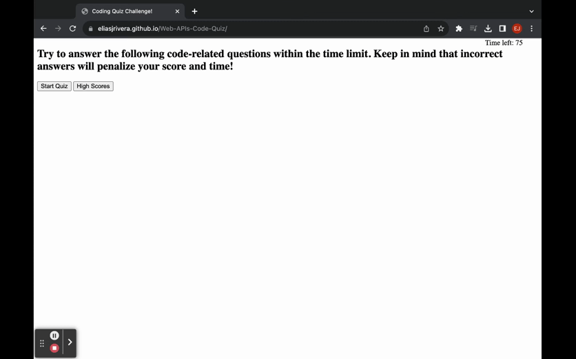

# Web-APIs-Code-Quiz

## Table of Contents
- [Description](#description)
- [User Story](#user-story)
- [Acceptance Criteria](#acceptance-criteria)
- [Visuals](#visuals)
- [Project Repo](#project-repo)
- [Deployed Site](#deployed-site)
- [Visuals](#visuals)
- [Installation](#installation)
- [Usage](#usage)
- [Support](#support)
- [Contributing](#contributing)
- [Authors and Acknowledgement](#authors-and-acknowledgement)
- [Project Status](#project-status)

## Description
  
### User Story
  
```
AS A coding boot camp student
I WANT to take a timed quiz on JavaScript fundamentals that stores high scores
SO THAT I can gauge my progress compared to my peers
```

### Acceptance Criteria

```
GIVEN I am taking a code quiz
WHEN I click the start button
THEN a timer starts and I am presented with a question
WHEN I answer a question
THEN I am presented with another question
WHEN I answer a question incorrectly
THEN time is subtracted from the clock
WHEN all questions are answered or the timer reaches 0
THEN the game is over
WHEN the game is over
THEN I can save my initials and my score
```

## Project Repo
[Elias Rivera GitHub Repo](https://github.com/eliasjrivera/Web-APIs-Code-Quiz)

## Deployed Site
[Web APIs Code Quiz Deployed Site](https://eliasjrivera.github.io/Web-APIs-Code-Quiz/)

## Visuals


## Installation
`git clone git@github.com:eliasjrivera/Web-APIs-Code-Quiz.git`

`Open in Google Chrome`

## Support
Elias Rivera

eliasjohnrivera@gmail.com

## Contributing
Contributors should read the installation section

## Authors and Acknowledgement
Elias Rivera

## Project Status
Project is finished