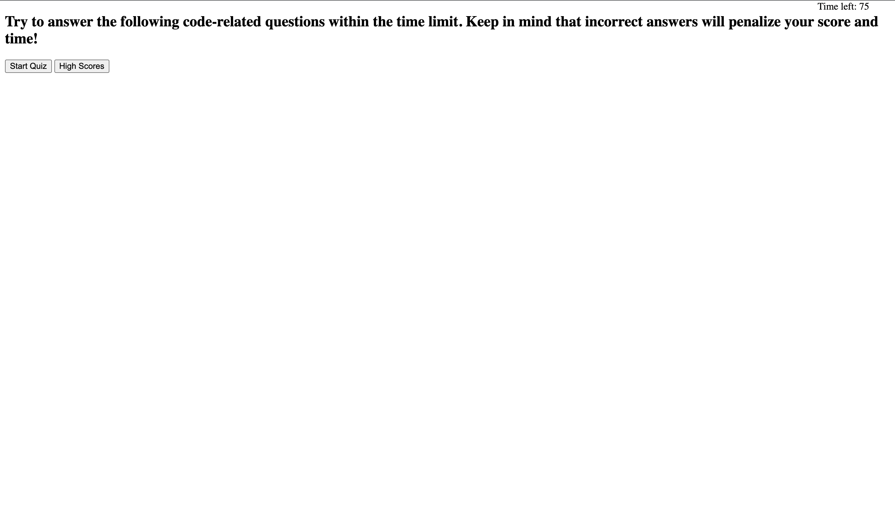
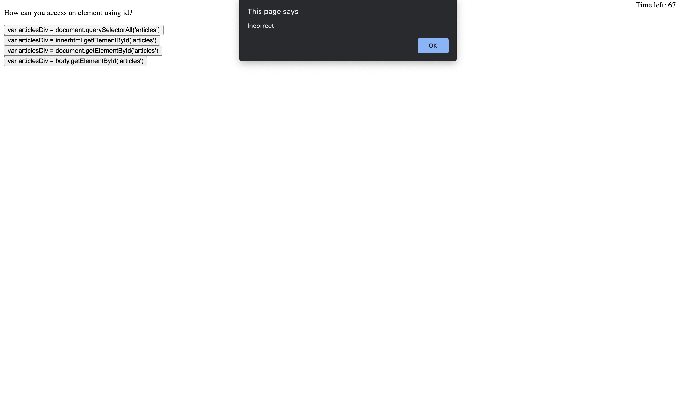
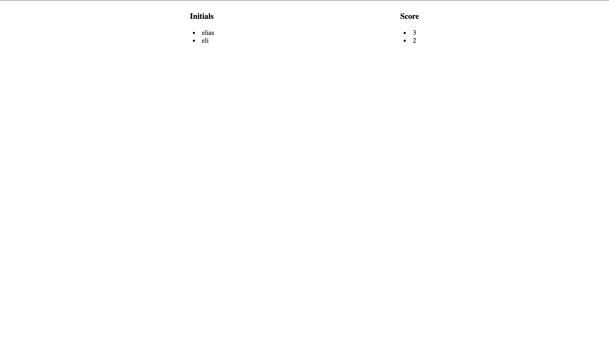

# Web-APIs-Code-Quiz

Name
 
Web APIs: Code Quiz
 
 
Description
 
When you click the start button then a timer starts and you are presented with a question. 
 
When you answer a question then you are presented with another question.  
 
When a question is answered incorrectly then time is subtrated from the clock.   
 
When all questions are answered or the timer reaches 0 then the game is over.  
 
When the game is over then you can save your initials and your score. 
 
 
Badges
 
 
Visuals

 
 
Project Webpage for Code Quiz
 
[insert here]
 
 
Installation
 
 
Usage
  
 
 
Support
 
Elias Rivera
eliasjohnrivera@gmail.com
 
 
Roadmap
 
 
Contributing
 
 
Authors and Acknowledgment 
 
Elias Rivera
 
 
License
 
 
Project Status 
 
Project is finished. 
